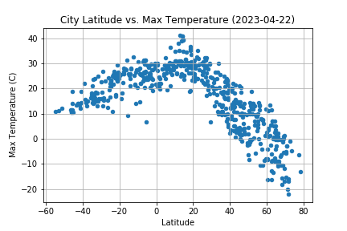
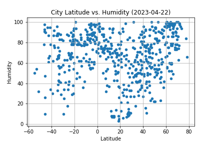
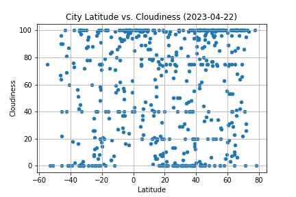
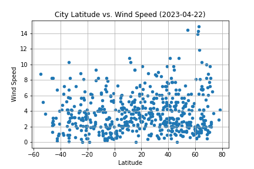

# python-api-challenge
Week 6 challenge

### Background
In this assignment we've taken what we learned about Python requests, APIs, and JSON traversals to answer a fundamental question: "What is the weather like as we approach the equator?"

### WeatherPy Findings
#### Latitude vs. Temperature

* The linear regression correlation (r-value) for the relationship between temperature and latitude:
In the Northern Hemisphere we show a correlation of .76 which is considered a strong correlation. This means that temperatures will stay in the pattern of lower temperature at higher latitude and vice versa. This is a predictable linear relationship.
In the Southern Hemisphere we show a correlation of .50 which is a low to moderate correlation. This is a weaker linear relationship and considered less predictable. This could be because there are more cities in northern latitude locations and fewer in the Southern Hemisphere, leaving less data avaialble for this calculation.

#### Latitude vs. Humidity

* The linear regression correlation (r-value) for the relationship between humidity and latitude:
In the Northern Hemisphere we show a correlation of .08 which is no correlation. There is no predictable linear relationship.
In the Southern Hemisphere we show a correlation of .09 which is no correlation. There is no predictable linear relationship.

#### Latitude vs. Cloudiness

* The linear regression correlation (r-value) for the relationship between cloudiness and latitude:
In the Northern Hemisphere we show a correlation of .009 which is no correlation. There is no predictable linear relationship.
In the Southern Hemisphere we show a correlation of .05 which is no correlation. There is no predictable linear relationship.

#### Latitude vs. Wind Speed

* The linear regression correlation (r-value) for the relationship between wind speed and latitude:
In the Northern Hemisphere we show a correlation of .002 which is no correlation. There is no predictable linear relationship.
In the Southern Hemisphere we show a correlation of .008 which is no correlation. There is no predictable linear relationship.

### VacationPy Findings

* The above map shows the cities from our WeatherPy dataframe above. The dot sizes represent the humidity level of each city mapped.

* The above map shows the cities found which meet my vacation weather preferences and have one or more hotels.